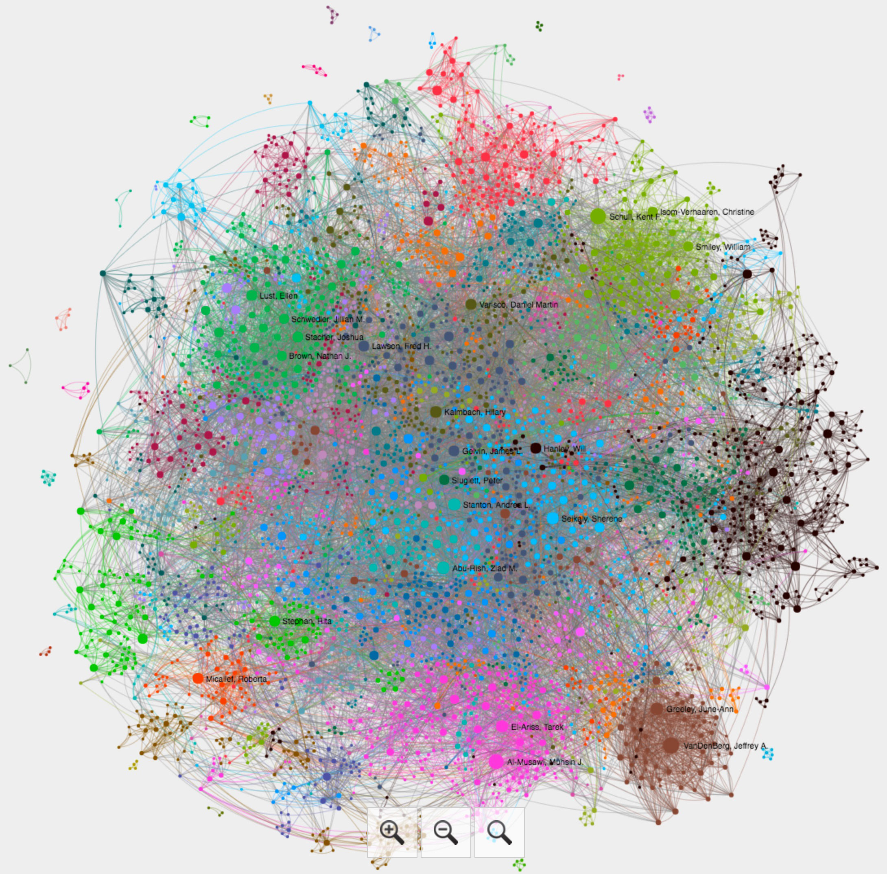
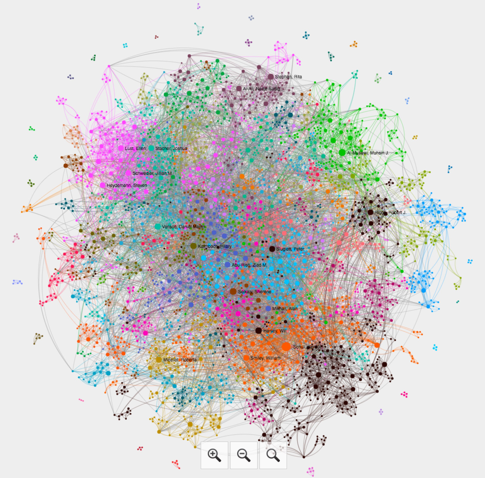

```{r echo=FALSE, results='hide', message=FALSE, warning=FALSE}
# setwd("/Users/romanov/Documents/c.GitProjects/maximromanov.github.io/") # run this line before starting
# servr::jekyll()

# echo=FALSE/TRUE :: hides/shows `r` code in the report
# results='hide/hide' :: ?
# message=TRUE/FALSE :: shows/hides a message if generated

require(ggplot2)
require(markdown)
require(knitr)
library(data.table)

#library("tm")
#library("SnowballC")
#library("wordcloud")
#library("RColorBrewer")

# data loading and preprocessing
#data <- fread("/Users/romanov/Documents/c.GitProjects/maximromanov.github.io/projects/mesa_network/rCommunities_data.txt", header=F, sep = '\t') # for local load
data <- fread("../projects/mesa_network/rCommunities_data.txt", header=F, sep = '\t')
colnames(data) = c("mod", "cat", "val", "freq")

catCount = as.vector(data$cat)
catTable = as.data.frame(table(catCount))

#    catCount Freq
# 1      DISC  502
# 2    EDU:BA  932
# 3    EDU:BS  108
# 4   EDU:JSD   21
# 5    EDU:MA 1148
# 6    EDU:MD    6
# 7  EDU:MISC   27
# 8    EDU:MS  130
# 9   EDU:PhD 1129
# 10      GEO 1464
# 11     LANG 1255
# 12   PERSON 4833
# 13  SUBDISC 2466

membersNumber = catTable[catTable=="PERSON",2]


# Modularity report
modPeop = data[data$cat=="PERSON",]
modCount = as.vector(modPeop$mod)
modTable = as.data.frame(table(modCount))

noComm = modTable[modTable==0,2]

modTable$relAll = with(modTable, Freq/membersNumber*100)
modTable$relOrg = with(modTable, Freq/(membersNumber-noComm)*100)

modTable = modTable[!modTable$modCount==0,]
modTable = modTable[order(-modTable$Freq),]

test = modTable[modTable$relOrg > 1,]

data1 = data[!data$val == "NA",]
data1 = data1[!data1$val == "Unknown",]
data1 = data1[!data1$val == "No Information",]

generateReport <- function(comm, categ, label){
  sub = data1[data1$mod == modTable$modCount[as.integer(comm)],]
  sub = sub[sub$cat == categ,]
  sub = sub[order(sub$freq),]
  
  # bar plot
  par(las=2) # make label text perpendicular to axis
  par(mar=c(3,20,0,3)) # increase y-axis margin.
  if (nrow(sub) <= 10) {
   l1 = 1
   l2 = nrow(sub)
  } else {
   l1 = nrow(sub)-10
   l2 = nrow(sub)
  }
  barsub = sub[l1:l2,]
  barplot(barsub$freq, horiz=TRUE, names.arg=barsub$val, cex.names=1.2)
  title(ylab=paste("Top 10", label), line=18, cex.lab=2)
  
#   # wordcloud
#   wordcloud(words = sub$val, freq = sub$freq, min.freq = 1, scale=c(3,.5),
#             max.words=200, random.order=FALSE, rot.per=0, 
#             colors=brewer.pal(8, "Dark2"))
#   
#   # table
#   table = sub[order(-sub$freq),]
#   table = table[table$freq > 1,]
#   table = subset(table, select = -c(mod,cat) )
#   names(table) = c(label, "Scholars")
#   
#   knitr::kable((table))
}

listReport <- function(comm, categ){
  # comm = "1"
  # categ = "SUBDISC"
  sub = data1[data1$mod == modTable$modCount[as.integer(comm)],]
  sub = sub[sub$cat == categ,]
  sub = sub[order(sub$freq),]
  
  # table
  table = sub[order(-sub$freq),]
  table = table[table$freq > 1,]
  table = subset(table, select = -c(mod,cat) )
  #names(table) = c(label, "Scholars")
  
  listReport <- paste0(table$val," (",table$freq,")")
  return(listReport)
}

topList <- function(comm, categ){
  # comm = "1"
  # categ = "SUBDISC"
  sub = data1[data1$mod == modTable$modCount[as.integer(comm)],]
  sub = sub[sub$cat == categ,]
  sub = sub[order(sub$freq),]
  
  # table
  table = sub[order(-sub$freq),]
  table = table[table$freq > 1,]
  table = subset(table, select = -c(mod,cat) )
  
  top = 5
  
  if (nrow(table) <= top) {
   l1 = 1
   l2 = nrow(table)
  } else {
   l1 = 1
   l2 = top
  }
  
  table = table[l1:l2,]
  #names(table) = c(label, "Scholars")
  
  listReport <- paste0(table$val," (",table$freq,")")
  return(listReport)
}

# listPeopleReport <- function(comm, categ){
#   # comm = "1"
#   # categ = "PERSON"
#   sub = data1[data1$mod == modTable$modCount[as.integer(comm)],]
#   sub = sub[sub$cat == categ,]
#   sub = sub[order(sub$freq),]
#   
#   # table
#   table = sub[order(-sub$freq),]
#   table = table[table$freq > 1,]
#   table = subset(table, select = -c(mod,cat) )
#   #names(table) = c(label, "Scholars")
#   
#   # unlist(strsplit(t, "[:]"))[index]
#   
#   u1 = '<a href="https://mesana.org/mymesa/directory_mem.php?mem='
#   u2 = 'target="_blank">'
#   u3 = '</a>'
#   
#   listReport <- paste0(u1,
#                        unlist(strsplit(table$val,"[:]"))[1],
#                        u2,
#                        unlist(strsplit(table$val,"[:]"))[2],
#                        u3,
#                        " (*weight:* ",
#                        table$freq,")")
#   return(listReport)
# }

```

Networks are fun to explore. The one here is based on programs of MESA annual meetings (2009–2016) that are available online at the [MESA Website](http://mesana.org/).

There are `r formatC(membersNumber, format="d", big.mark=",")` members on the MESA website at the moment; `r formatC(noComm, format="d", big.mark=",")` members have no participated in an organized panel, round table or a thematic conversation.


[](../projects/mesa_network/full_network.jpg)

Since it is common at MESA to put papers into adhoc/assembled sessions, we occasionally find ourselves in an unfamiliar company. For this reason it makes sense to exclude 

[](../projects/mesa_network/org_network.jpg)


Top 25 communities are `r as.vector(modTable$modCount[1:25])`.

# On data, method and techniques

The data has been collected from the official MESA website—only what is openly accessible has been included into the dataset (in other words, if you chose not to make your profile public, your data is not in the dataset). The data has been downloaded with `wget`, reformatted with a series of scripts written in `python`. The data was then reformatted into two network models: 1) where scholars are connected through all the panels and sessions they participated in; 2) where scholars are connected only through panels and sessions that  were pre-organized; in other words, assembled panels—i.e. those in which we end up when we submit a single paper—were excluded from the second model so that the dataset includes only connections that scholars themselves choose. In both cases, scholars with multiple roles (such as an Organizer and a Presenter) were given more `weight`, to stress their active engagement. The network analysis is performed in [Gephi](https://gephi.org/), and the results were saved into an interactive network using [Sigma.js](https://marketplace.gephi.org/plugin/sigmajs-exporter/) plugin. Detailed reports were then algorithmically generated for all major *intellectual communities* (with the size of at least 1%) using `R`, `R Markdown`, and the [`knitr`](http://yihui.name/knitr/) package (**NB:** A special thank you to [Thomas Köntges](http://www.dh.uni-leipzig.de/wo/team/thomas-koentges/) for repeating time and again that I should be using `knitr`!). The raw blogpost with `R` code can be found on my [github](https://github.com/maximromanov/maximromanov.github.io). Some data cleaning—mainly to unify different spellings—was done with [OpenRefine](http://openrefine.org/).

# What's in the reports?

Some explanations about numbers are in order...

# List of community reports

- [#1: ???](#community-1-modularity-`r modTable$modCount[1]`)
- [#2: ???](#community-2-modularity-`r modTable$modCount[2]`)
- [#3: ???](#community-3-modularity-`r modTable$modCount[3]`)
- [#4: ???](#community-4-modularity-`r modTable$modCount[4]`)
- [#5: ???](#community-5-modularity-`r modTable$modCount[5]`)
- [#6: ???](#community-6-modularity-`r modTable$modCount[6]`)
- [#7: ???](#community-7-modularity-`r modTable$modCount[7]`)
- [#8: ???](#community-8-modularity-`r modTable$modCount[8]`)
- [#9: ???](#community-9-modularity-`r modTable$modCount[9]`)
- [#10: ???](#community-10-modularity-`r modTable$modCount[10]`)
- [#11: ???](#community-11-modularity-`r modTable$modCount[11]`)
- [#12: ???](#community-12-modularity-`r modTable$modCount[12]`)
- [#13: ???](#community-13-modularity-`r modTable$modCount[13]`)
- [#14: ???](#community-14-modularity-`r modTable$modCount[14]`)
- [#15: ???](#community-15-modularity-`r modTable$modCount[15]`)
- [#16: ???](#community-16-modularity-`r modTable$modCount[16]`)
- [#17: ???](#community-17-modularity-`r modTable$modCount[17]`)
- [#18: ???](#community-18-modularity-`r modTable$modCount[18]`)
- [#19: ???](#community-19-modularity-`r modTable$modCount[19]`)
- [#20: ???](#community-20-modularity-`r modTable$modCount[20]`)
- [#21: ???](#community-21-modularity-`r modTable$modCount[21]`)
- [#22: ???](#community-22-modularity-`r modTable$modCount[22]`)
- [#23: ???](#community-23-modularity-`r modTable$modCount[23]`)
- [#24: ???](#community-24-modularity-`r modTable$modCount[24]`)
- [#25: ???](#community-25-modularity-`r modTable$modCount[25]`)
- [#26: ???](#community-26-modularity-`r modTable$modCount[26]`)
- [#27: ???](#community-27-modularity-`r modTable$modCount[27]`)
- [#28: ???](#community-28-modularity-`r modTable$modCount[28]`)


# List of community reports


```{r echo=FALSE, results='show',message=TRUE, fig.width=12, fig.height=6, dpi=150}
community = "1"
comNum = modTable$Freq[as.integer(community)]
comPer = modTable$relAll[as.integer(community)]
```

## Community #`r community` (*Modularity*: `r modTable$modCount[as.integer(community)]`)

The community has **`r formatC(comNum, format = "f", digits = 3, drop0trailing = TRUE)` members (`r formatC(comPer, format = "f", digits = 3, drop0trailing = TRUE)`%)**. The top features of the community are as follows: **Disciplines**: `r topList(community, "DISC")`; **Subfields**: `r topList(community, "SUBDISC")`; **Geographical focus**: `r topList(community, "GEO")`; **Languages of expertise**: `r topList(community, "LANG")`; **Members have degrees from**: `r topList(community, "EDU")`; **Most active members are**: `r topList(community, "PERSON")`.

### 1. Disciplines

```{r echo=FALSE, results='show',message=TRUE, fig.width=12, fig.height=6, dpi=150}
generateReport(community, "DISC", "Disciplines")
```

*Detailed list of disciplines*: `r listReport(community, "DISC")`

### 2. Subfields

```{r echo=FALSE, results='show',message=TRUE, fig.width=12, fig.height=6, dpi=150}
generateReport(community, "SUBDISC", "SUBFIELDS")
```

*Detailed list of subdisciplines*: `r listReport(community, "SUBDISC")`

### 3. Geographical focus

```{r echo=FALSE, results='show',message=TRUE, fig.width=12, fig.height=6, dpi=150}
generateReport(community, "GEO", "GEOGRAPHICAL REGIONS")
```

*Detailed list of geographical regions*: `r listReport(community, "GEO")`

### 4. Languages of expertise


```{r echo=FALSE, results='show',message=TRUE, fig.width=12, fig.height=6, dpi=150}
generateReport(community, "LANG", "LANGUAGES")
```

*Detailed list of languages*: `r listReport(community, "LANG")`


### 5. Degree granting institutions

```{r echo=FALSE, results='show',message=TRUE, fig.width=12, fig.height=6, dpi=150}
generateReport(community, "EDU", "University Degrees")
```

*Detailed list of degree granting institutions*: `r listReport(community, "EDU")`

### 6. Most active members of the community

`r listReport(community, "PERSON")`


```{r echo=FALSE, results='show',message=TRUE, fig.width=12, fig.height=6, dpi=150}
community = "2"
comNum = modTable$Freq[as.integer(community)]
comPer = modTable$relAll[as.integer(community)]
```

## Community #`r community` (*Modularity*: `r modTable$modCount[as.integer(community)]`)

The community has **`r formatC(comNum, format = "f", digits = 3, drop0trailing = TRUE)` members (`r formatC(comPer, format = "f", digits = 3, drop0trailing = TRUE)`%)**. The top features of the community are as follows: **Disciplines**: `r topList(community, "DISC")`; **Subfields**: `r topList(community, "SUBDISC")`; **Geographical focus**: `r topList(community, "GEO")`; **Languages of expertise**: `r topList(community, "LANG")`; **Members have degrees from**: `r topList(community, "EDU")`; **Most active members are**: `r topList(community, "PERSON")`.

### 1. Disciplines

```{r echo=FALSE, results='show',message=TRUE, fig.width=12, fig.height=6, dpi=150}
generateReport(community, "DISC", "Disciplines")
```

*Detailed list of disciplines*: `r listReport(community, "DISC")`

### 2. Subfields

```{r echo=FALSE, results='show',message=TRUE, fig.width=12, fig.height=6, dpi=150}
generateReport(community, "SUBDISC", "SUBFIELDS")
```

*Detailed list of subdisciplines*: `r listReport(community, "SUBDISC")`

### 3. Geographical focus

```{r echo=FALSE, results='show',message=TRUE, fig.width=12, fig.height=6, dpi=150}
generateReport(community, "GEO", "GEOGRAPHICAL REGIONS")
```

*Detailed list of geographical regions*: `r listReport(community, "GEO")`

### 4. Languages of expertise


```{r echo=FALSE, results='show',message=TRUE, fig.width=12, fig.height=6, dpi=150}
generateReport(community, "LANG", "LANGUAGES")
```

*Detailed list of languages*: `r listReport(community, "LANG")`


### 5. Degree granting institutions

```{r echo=FALSE, results='show',message=TRUE, fig.width=12, fig.height=6, dpi=150}
generateReport(community, "EDU", "University Degrees")
```

*Detailed list of degree granting institutions*: `r listReport(community, "EDU")`

### 6. Most active members of the community

`r listReport(community, "PERSON")`


```{r echo=FALSE, results='show',message=TRUE, fig.width=12, fig.height=6, dpi=150}
community = "3"
comNum = modTable$Freq[as.integer(community)]
comPer = modTable$relAll[as.integer(community)]
```

## Community #`r community` (*Modularity*: `r modTable$modCount[as.integer(community)]`)

The community has **`r formatC(comNum, format = "f", digits = 3, drop0trailing = TRUE)` members (`r formatC(comPer, format = "f", digits = 3, drop0trailing = TRUE)`%)**. The top features of the community are as follows: **Disciplines**: `r topList(community, "DISC")`; **Subfields**: `r topList(community, "SUBDISC")`; **Geographical focus**: `r topList(community, "GEO")`; **Languages of expertise**: `r topList(community, "LANG")`; **Members have degrees from**: `r topList(community, "EDU")`; **Most active members are**: `r topList(community, "PERSON")`.

### 1. Disciplines

```{r echo=FALSE, results='show',message=TRUE, fig.width=12, fig.height=6, dpi=150}
generateReport(community, "DISC", "Disciplines")
```

*Detailed list of disciplines*: `r listReport(community, "DISC")`

### 2. Subfields

```{r echo=FALSE, results='show',message=TRUE, fig.width=12, fig.height=6, dpi=150}
generateReport(community, "SUBDISC", "SUBFIELDS")
```

*Detailed list of subdisciplines*: `r listReport(community, "SUBDISC")`

### 3. Geographical focus

```{r echo=FALSE, results='show',message=TRUE, fig.width=12, fig.height=6, dpi=150}
generateReport(community, "GEO", "GEOGRAPHICAL REGIONS")
```

*Detailed list of geographical regions*: `r listReport(community, "GEO")`

### 4. Languages of expertise


```{r echo=FALSE, results='show',message=TRUE, fig.width=12, fig.height=6, dpi=150}
generateReport(community, "LANG", "LANGUAGES")
```

*Detailed list of languages*: `r listReport(community, "LANG")`


### 5. Degree granting institutions

```{r echo=FALSE, results='show',message=TRUE, fig.width=12, fig.height=6, dpi=150}
generateReport(community, "EDU", "University Degrees")
```

*Detailed list of degree granting institutions*: `r listReport(community, "EDU")`

### 6. Most active members of the community

`r listReport(community, "PERSON")`


```{r echo=FALSE, results='show',message=TRUE, fig.width=12, fig.height=6, dpi=150}
community = "4"
comNum = modTable$Freq[as.integer(community)]
comPer = modTable$relAll[as.integer(community)]
```

## Community #`r community` (*Modularity*: `r modTable$modCount[as.integer(community)]`)

The community has **`r formatC(comNum, format = "f", digits = 3, drop0trailing = TRUE)` members (`r formatC(comPer, format = "f", digits = 3, drop0trailing = TRUE)`%)**. The top features of the community are as follows: **Disciplines**: `r topList(community, "DISC")`; **Subfields**: `r topList(community, "SUBDISC")`; **Geographical focus**: `r topList(community, "GEO")`; **Languages of expertise**: `r topList(community, "LANG")`; **Members have degrees from**: `r topList(community, "EDU")`; **Most active members are**: `r topList(community, "PERSON")`.

### 1. Disciplines

```{r echo=FALSE, results='show',message=TRUE, fig.width=12, fig.height=6, dpi=150}
generateReport(community, "DISC", "Disciplines")
```

*Detailed list of disciplines*: `r listReport(community, "DISC")`

### 2. Subfields

```{r echo=FALSE, results='show',message=TRUE, fig.width=12, fig.height=6, dpi=150}
generateReport(community, "SUBDISC", "SUBFIELDS")
```

*Detailed list of subdisciplines*: `r listReport(community, "SUBDISC")`

### 3. Geographical focus

```{r echo=FALSE, results='show',message=TRUE, fig.width=12, fig.height=6, dpi=150}
generateReport(community, "GEO", "GEOGRAPHICAL REGIONS")
```

*Detailed list of geographical regions*: `r listReport(community, "GEO")`

### 4. Languages of expertise


```{r echo=FALSE, results='show',message=TRUE, fig.width=12, fig.height=6, dpi=150}
generateReport(community, "LANG", "LANGUAGES")
```

*Detailed list of languages*: `r listReport(community, "LANG")`


### 5. Degree granting institutions

```{r echo=FALSE, results='show',message=TRUE, fig.width=12, fig.height=6, dpi=150}
generateReport(community, "EDU", "University Degrees")
```

*Detailed list of degree granting institutions*: `r listReport(community, "EDU")`

### 6. Most active members of the community

`r listReport(community, "PERSON")`


```{r echo=FALSE, results='show',message=TRUE, fig.width=12, fig.height=6, dpi=150}
community = "5"
comNum = modTable$Freq[as.integer(community)]
comPer = modTable$relAll[as.integer(community)]
```

## Community #`r community` (*Modularity*: `r modTable$modCount[as.integer(community)]`)

The community has **`r formatC(comNum, format = "f", digits = 3, drop0trailing = TRUE)` members (`r formatC(comPer, format = "f", digits = 3, drop0trailing = TRUE)`%)**. The top features of the community are as follows: **Disciplines**: `r topList(community, "DISC")`; **Subfields**: `r topList(community, "SUBDISC")`; **Geographical focus**: `r topList(community, "GEO")`; **Languages of expertise**: `r topList(community, "LANG")`; **Members have degrees from**: `r topList(community, "EDU")`; **Most active members are**: `r topList(community, "PERSON")`.

### 1. Disciplines

```{r echo=FALSE, results='show',message=TRUE, fig.width=12, fig.height=6, dpi=150}
generateReport(community, "DISC", "Disciplines")
```

*Detailed list of disciplines*: `r listReport(community, "DISC")`

### 2. Subfields

```{r echo=FALSE, results='show',message=TRUE, fig.width=12, fig.height=6, dpi=150}
generateReport(community, "SUBDISC", "SUBFIELDS")
```

*Detailed list of subdisciplines*: `r listReport(community, "SUBDISC")`

### 3. Geographical focus

```{r echo=FALSE, results='show',message=TRUE, fig.width=12, fig.height=6, dpi=150}
generateReport(community, "GEO", "GEOGRAPHICAL REGIONS")
```

*Detailed list of geographical regions*: `r listReport(community, "GEO")`

### 4. Languages of expertise


```{r echo=FALSE, results='show',message=TRUE, fig.width=12, fig.height=6, dpi=150}
generateReport(community, "LANG", "LANGUAGES")
```

*Detailed list of languages*: `r listReport(community, "LANG")`


### 5. Degree granting institutions

```{r echo=FALSE, results='show',message=TRUE, fig.width=12, fig.height=6, dpi=150}
generateReport(community, "EDU", "University Degrees")
```

*Detailed list of degree granting institutions*: `r listReport(community, "EDU")`

### 6. Most active members of the community

`r listReport(community, "PERSON")`


```{r echo=FALSE, results='show',message=TRUE, fig.width=12, fig.height=6, dpi=150}
community = "6"
comNum = modTable$Freq[as.integer(community)]
comPer = modTable$relAll[as.integer(community)]
```

## Community #`r community` (*Modularity*: `r modTable$modCount[as.integer(community)]`)

The community has **`r formatC(comNum, format = "f", digits = 3, drop0trailing = TRUE)` members (`r formatC(comPer, format = "f", digits = 3, drop0trailing = TRUE)`%)**. The top features of the community are as follows: **Disciplines**: `r topList(community, "DISC")`; **Subfields**: `r topList(community, "SUBDISC")`; **Geographical focus**: `r topList(community, "GEO")`; **Languages of expertise**: `r topList(community, "LANG")`; **Members have degrees from**: `r topList(community, "EDU")`; **Most active members are**: `r topList(community, "PERSON")`.

### 1. Disciplines

```{r echo=FALSE, results='show',message=TRUE, fig.width=12, fig.height=6, dpi=150}
generateReport(community, "DISC", "Disciplines")
```

*Detailed list of disciplines*: `r listReport(community, "DISC")`

### 2. Subfields

```{r echo=FALSE, results='show',message=TRUE, fig.width=12, fig.height=6, dpi=150}
generateReport(community, "SUBDISC", "SUBFIELDS")
```

*Detailed list of subdisciplines*: `r listReport(community, "SUBDISC")`

### 3. Geographical focus

```{r echo=FALSE, results='show',message=TRUE, fig.width=12, fig.height=6, dpi=150}
generateReport(community, "GEO", "GEOGRAPHICAL REGIONS")
```

*Detailed list of geographical regions*: `r listReport(community, "GEO")`

### 4. Languages of expertise


```{r echo=FALSE, results='show',message=TRUE, fig.width=12, fig.height=6, dpi=150}
generateReport(community, "LANG", "LANGUAGES")
```

*Detailed list of languages*: `r listReport(community, "LANG")`


### 5. Degree granting institutions

```{r echo=FALSE, results='show',message=TRUE, fig.width=12, fig.height=6, dpi=150}
generateReport(community, "EDU", "University Degrees")
```

*Detailed list of degree granting institutions*: `r listReport(community, "EDU")`

### 6. Most active members of the community

`r listReport(community, "PERSON")`


```{r echo=FALSE, results='show',message=TRUE, fig.width=12, fig.height=6, dpi=150}
community = "7"
comNum = modTable$Freq[as.integer(community)]
comPer = modTable$relAll[as.integer(community)]
```

## Community #`r community` (*Modularity*: `r modTable$modCount[as.integer(community)]`)

The community has **`r formatC(comNum, format = "f", digits = 3, drop0trailing = TRUE)` members (`r formatC(comPer, format = "f", digits = 3, drop0trailing = TRUE)`%)**. The top features of the community are as follows: **Disciplines**: `r topList(community, "DISC")`; **Subfields**: `r topList(community, "SUBDISC")`; **Geographical focus**: `r topList(community, "GEO")`; **Languages of expertise**: `r topList(community, "LANG")`; **Members have degrees from**: `r topList(community, "EDU")`; **Most active members are**: `r topList(community, "PERSON")`.

### 1. Disciplines

```{r echo=FALSE, results='show',message=TRUE, fig.width=12, fig.height=6, dpi=150}
generateReport(community, "DISC", "Disciplines")
```

*Detailed list of disciplines*: `r listReport(community, "DISC")`

### 2. Subfields

```{r echo=FALSE, results='show',message=TRUE, fig.width=12, fig.height=6, dpi=150}
generateReport(community, "SUBDISC", "SUBFIELDS")
```

*Detailed list of subdisciplines*: `r listReport(community, "SUBDISC")`

### 3. Geographical focus

```{r echo=FALSE, results='show',message=TRUE, fig.width=12, fig.height=6, dpi=150}
generateReport(community, "GEO", "GEOGRAPHICAL REGIONS")
```

*Detailed list of geographical regions*: `r listReport(community, "GEO")`

### 4. Languages of expertise


```{r echo=FALSE, results='show',message=TRUE, fig.width=12, fig.height=6, dpi=150}
generateReport(community, "LANG", "LANGUAGES")
```

*Detailed list of languages*: `r listReport(community, "LANG")`


### 5. Degree granting institutions

```{r echo=FALSE, results='show',message=TRUE, fig.width=12, fig.height=6, dpi=150}
generateReport(community, "EDU", "University Degrees")
```

*Detailed list of degree granting institutions*: `r listReport(community, "EDU")`

### 6. Most active members of the community

`r listReport(community, "PERSON")`


```{r echo=FALSE, results='show',message=TRUE, fig.width=12, fig.height=6, dpi=150}
community = "8"
comNum = modTable$Freq[as.integer(community)]
comPer = modTable$relAll[as.integer(community)]
```

## Community #`r community` (*Modularity*: `r modTable$modCount[as.integer(community)]`)

The community has **`r formatC(comNum, format = "f", digits = 3, drop0trailing = TRUE)` members (`r formatC(comPer, format = "f", digits = 3, drop0trailing = TRUE)`%)**. The top features of the community are as follows: **Disciplines**: `r topList(community, "DISC")`; **Subfields**: `r topList(community, "SUBDISC")`; **Geographical focus**: `r topList(community, "GEO")`; **Languages of expertise**: `r topList(community, "LANG")`; **Members have degrees from**: `r topList(community, "EDU")`; **Most active members are**: `r topList(community, "PERSON")`.

### 1. Disciplines

```{r echo=FALSE, results='show',message=TRUE, fig.width=12, fig.height=6, dpi=150}
generateReport(community, "DISC", "Disciplines")
```

*Detailed list of disciplines*: `r listReport(community, "DISC")`

### 2. Subfields

```{r echo=FALSE, results='show',message=TRUE, fig.width=12, fig.height=6, dpi=150}
generateReport(community, "SUBDISC", "SUBFIELDS")
```

*Detailed list of subdisciplines*: `r listReport(community, "SUBDISC")`

### 3. Geographical focus

```{r echo=FALSE, results='show',message=TRUE, fig.width=12, fig.height=6, dpi=150}
generateReport(community, "GEO", "GEOGRAPHICAL REGIONS")
```

*Detailed list of geographical regions*: `r listReport(community, "GEO")`

### 4. Languages of expertise


```{r echo=FALSE, results='show',message=TRUE, fig.width=12, fig.height=6, dpi=150}
generateReport(community, "LANG", "LANGUAGES")
```

*Detailed list of languages*: `r listReport(community, "LANG")`


### 5. Degree granting institutions

```{r echo=FALSE, results='show',message=TRUE, fig.width=12, fig.height=6, dpi=150}
generateReport(community, "EDU", "University Degrees")
```

*Detailed list of degree granting institutions*: `r listReport(community, "EDU")`

### 6. Most active members of the community

`r listReport(community, "PERSON")`


```{r echo=FALSE, results='show',message=TRUE, fig.width=12, fig.height=6, dpi=150}
community = "9"
comNum = modTable$Freq[as.integer(community)]
comPer = modTable$relAll[as.integer(community)]
```

## Community #`r community` (*Modularity*: `r modTable$modCount[as.integer(community)]`)

The community has **`r formatC(comNum, format = "f", digits = 3, drop0trailing = TRUE)` members (`r formatC(comPer, format = "f", digits = 3, drop0trailing = TRUE)`%)**. The top features of the community are as follows: **Disciplines**: `r topList(community, "DISC")`; **Subfields**: `r topList(community, "SUBDISC")`; **Geographical focus**: `r topList(community, "GEO")`; **Languages of expertise**: `r topList(community, "LANG")`; **Members have degrees from**: `r topList(community, "EDU")`; **Most active members are**: `r topList(community, "PERSON")`.

### 1. Disciplines

```{r echo=FALSE, results='show',message=TRUE, fig.width=12, fig.height=6, dpi=150}
generateReport(community, "DISC", "Disciplines")
```

*Detailed list of disciplines*: `r listReport(community, "DISC")`

### 2. Subfields

```{r echo=FALSE, results='show',message=TRUE, fig.width=12, fig.height=6, dpi=150}
generateReport(community, "SUBDISC", "SUBFIELDS")
```

*Detailed list of subdisciplines*: `r listReport(community, "SUBDISC")`

### 3. Geographical focus

```{r echo=FALSE, results='show',message=TRUE, fig.width=12, fig.height=6, dpi=150}
generateReport(community, "GEO", "GEOGRAPHICAL REGIONS")
```

*Detailed list of geographical regions*: `r listReport(community, "GEO")`

### 4. Languages of expertise


```{r echo=FALSE, results='show',message=TRUE, fig.width=12, fig.height=6, dpi=150}
generateReport(community, "LANG", "LANGUAGES")
```

*Detailed list of languages*: `r listReport(community, "LANG")`


### 5. Degree granting institutions

```{r echo=FALSE, results='show',message=TRUE, fig.width=12, fig.height=6, dpi=150}
generateReport(community, "EDU", "University Degrees")
```

*Detailed list of degree granting institutions*: `r listReport(community, "EDU")`

### 6. Most active members of the community

`r listReport(community, "PERSON")`


```{r echo=FALSE, results='show',message=TRUE, fig.width=12, fig.height=6, dpi=150}
community = "10"
comNum = modTable$Freq[as.integer(community)]
comPer = modTable$relAll[as.integer(community)]
```

## Community #`r community` (*Modularity*: `r modTable$modCount[as.integer(community)]`)

The community has **`r formatC(comNum, format = "f", digits = 3, drop0trailing = TRUE)` members (`r formatC(comPer, format = "f", digits = 3, drop0trailing = TRUE)`%)**. The top features of the community are as follows: **Disciplines**: `r topList(community, "DISC")`; **Subfields**: `r topList(community, "SUBDISC")`; **Geographical focus**: `r topList(community, "GEO")`; **Languages of expertise**: `r topList(community, "LANG")`; **Members have degrees from**: `r topList(community, "EDU")`; **Most active members are**: `r topList(community, "PERSON")`.

### 1. Disciplines

```{r echo=FALSE, results='show',message=TRUE, fig.width=12, fig.height=6, dpi=150}
generateReport(community, "DISC", "Disciplines")
```

*Detailed list of disciplines*: `r listReport(community, "DISC")`

### 2. Subfields

```{r echo=FALSE, results='show',message=TRUE, fig.width=12, fig.height=6, dpi=150}
generateReport(community, "SUBDISC", "SUBFIELDS")
```

*Detailed list of subdisciplines*: `r listReport(community, "SUBDISC")`

### 3. Geographical focus

```{r echo=FALSE, results='show',message=TRUE, fig.width=12, fig.height=6, dpi=150}
generateReport(community, "GEO", "GEOGRAPHICAL REGIONS")
```

*Detailed list of geographical regions*: `r listReport(community, "GEO")`

### 4. Languages of expertise


```{r echo=FALSE, results='show',message=TRUE, fig.width=12, fig.height=6, dpi=150}
generateReport(community, "LANG", "LANGUAGES")
```

*Detailed list of languages*: `r listReport(community, "LANG")`


### 5. Degree granting institutions

```{r echo=FALSE, results='show',message=TRUE, fig.width=12, fig.height=6, dpi=150}
generateReport(community, "EDU", "University Degrees")
```

*Detailed list of degree granting institutions*: `r listReport(community, "EDU")`

### 6. Most active members of the community

`r listReport(community, "PERSON")`


```{r echo=FALSE, results='show',message=TRUE, fig.width=12, fig.height=6, dpi=150}
community = "11"
comNum = modTable$Freq[as.integer(community)]
comPer = modTable$relAll[as.integer(community)]
```

## Community #`r community` (*Modularity*: `r modTable$modCount[as.integer(community)]`)

The community has **`r formatC(comNum, format = "f", digits = 3, drop0trailing = TRUE)` members (`r formatC(comPer, format = "f", digits = 3, drop0trailing = TRUE)`%)**. The top features of the community are as follows: **Disciplines**: `r topList(community, "DISC")`; **Subfields**: `r topList(community, "SUBDISC")`; **Geographical focus**: `r topList(community, "GEO")`; **Languages of expertise**: `r topList(community, "LANG")`; **Members have degrees from**: `r topList(community, "EDU")`; **Most active members are**: `r topList(community, "PERSON")`.

### 1. Disciplines

```{r echo=FALSE, results='show',message=TRUE, fig.width=12, fig.height=6, dpi=150}
generateReport(community, "DISC", "Disciplines")
```

*Detailed list of disciplines*: `r listReport(community, "DISC")`

### 2. Subfields

```{r echo=FALSE, results='show',message=TRUE, fig.width=12, fig.height=6, dpi=150}
generateReport(community, "SUBDISC", "SUBFIELDS")
```

*Detailed list of subdisciplines*: `r listReport(community, "SUBDISC")`

### 3. Geographical focus

```{r echo=FALSE, results='show',message=TRUE, fig.width=12, fig.height=6, dpi=150}
generateReport(community, "GEO", "GEOGRAPHICAL REGIONS")
```

*Detailed list of geographical regions*: `r listReport(community, "GEO")`

### 4. Languages of expertise


```{r echo=FALSE, results='show',message=TRUE, fig.width=12, fig.height=6, dpi=150}
generateReport(community, "LANG", "LANGUAGES")
```

*Detailed list of languages*: `r listReport(community, "LANG")`


### 5. Degree granting institutions

```{r echo=FALSE, results='show',message=TRUE, fig.width=12, fig.height=6, dpi=150}
generateReport(community, "EDU", "University Degrees")
```

*Detailed list of degree granting institutions*: `r listReport(community, "EDU")`

### 6. Most active members of the community

`r listReport(community, "PERSON")`


```{r echo=FALSE, results='show',message=TRUE, fig.width=12, fig.height=6, dpi=150}
community = "12"
comNum = modTable$Freq[as.integer(community)]
comPer = modTable$relAll[as.integer(community)]
```

## Community #`r community` (*Modularity*: `r modTable$modCount[as.integer(community)]`)

The community has **`r formatC(comNum, format = "f", digits = 3, drop0trailing = TRUE)` members (`r formatC(comPer, format = "f", digits = 3, drop0trailing = TRUE)`%)**. The top features of the community are as follows: **Disciplines**: `r topList(community, "DISC")`; **Subfields**: `r topList(community, "SUBDISC")`; **Geographical focus**: `r topList(community, "GEO")`; **Languages of expertise**: `r topList(community, "LANG")`; **Members have degrees from**: `r topList(community, "EDU")`; **Most active members are**: `r topList(community, "PERSON")`.

### 1. Disciplines

```{r echo=FALSE, results='show',message=TRUE, fig.width=12, fig.height=6, dpi=150}
generateReport(community, "DISC", "Disciplines")
```

*Detailed list of disciplines*: `r listReport(community, "DISC")`

### 2. Subfields

```{r echo=FALSE, results='show',message=TRUE, fig.width=12, fig.height=6, dpi=150}
generateReport(community, "SUBDISC", "SUBFIELDS")
```

*Detailed list of subdisciplines*: `r listReport(community, "SUBDISC")`

### 3. Geographical focus

```{r echo=FALSE, results='show',message=TRUE, fig.width=12, fig.height=6, dpi=150}
generateReport(community, "GEO", "GEOGRAPHICAL REGIONS")
```

*Detailed list of geographical regions*: `r listReport(community, "GEO")`

### 4. Languages of expertise


```{r echo=FALSE, results='show',message=TRUE, fig.width=12, fig.height=6, dpi=150}
generateReport(community, "LANG", "LANGUAGES")
```

*Detailed list of languages*: `r listReport(community, "LANG")`


### 5. Degree granting institutions

```{r echo=FALSE, results='show',message=TRUE, fig.width=12, fig.height=6, dpi=150}
generateReport(community, "EDU", "University Degrees")
```

*Detailed list of degree granting institutions*: `r listReport(community, "EDU")`

### 6. Most active members of the community

`r listReport(community, "PERSON")`


```{r echo=FALSE, results='show',message=TRUE, fig.width=12, fig.height=6, dpi=150}
community = "13"
comNum = modTable$Freq[as.integer(community)]
comPer = modTable$relAll[as.integer(community)]
```

## Community #`r community` (*Modularity*: `r modTable$modCount[as.integer(community)]`)

The community has **`r formatC(comNum, format = "f", digits = 3, drop0trailing = TRUE)` members (`r formatC(comPer, format = "f", digits = 3, drop0trailing = TRUE)`%)**. The top features of the community are as follows: **Disciplines**: `r topList(community, "DISC")`; **Subfields**: `r topList(community, "SUBDISC")`; **Geographical focus**: `r topList(community, "GEO")`; **Languages of expertise**: `r topList(community, "LANG")`; **Members have degrees from**: `r topList(community, "EDU")`; **Most active members are**: `r topList(community, "PERSON")`.

### 1. Disciplines

```{r echo=FALSE, results='show',message=TRUE, fig.width=12, fig.height=6, dpi=150}
generateReport(community, "DISC", "Disciplines")
```

*Detailed list of disciplines*: `r listReport(community, "DISC")`

### 2. Subfields

```{r echo=FALSE, results='show',message=TRUE, fig.width=12, fig.height=6, dpi=150}
generateReport(community, "SUBDISC", "SUBFIELDS")
```

*Detailed list of subdisciplines*: `r listReport(community, "SUBDISC")`

### 3. Geographical focus

```{r echo=FALSE, results='show',message=TRUE, fig.width=12, fig.height=6, dpi=150}
generateReport(community, "GEO", "GEOGRAPHICAL REGIONS")
```

*Detailed list of geographical regions*: `r listReport(community, "GEO")`

### 4. Languages of expertise


```{r echo=FALSE, results='show',message=TRUE, fig.width=12, fig.height=6, dpi=150}
generateReport(community, "LANG", "LANGUAGES")
```

*Detailed list of languages*: `r listReport(community, "LANG")`


### 5. Degree granting institutions

```{r echo=FALSE, results='show',message=TRUE, fig.width=12, fig.height=6, dpi=150}
generateReport(community, "EDU", "University Degrees")
```

*Detailed list of degree granting institutions*: `r listReport(community, "EDU")`

### 6. Most active members of the community

`r listReport(community, "PERSON")`


```{r echo=FALSE, results='show',message=TRUE, fig.width=12, fig.height=6, dpi=150}
community = "14"
comNum = modTable$Freq[as.integer(community)]
comPer = modTable$relAll[as.integer(community)]
```

## Community #`r community` (*Modularity*: `r modTable$modCount[as.integer(community)]`)

The community has **`r formatC(comNum, format = "f", digits = 3, drop0trailing = TRUE)` members (`r formatC(comPer, format = "f", digits = 3, drop0trailing = TRUE)`%)**. The top features of the community are as follows: **Disciplines**: `r topList(community, "DISC")`; **Subfields**: `r topList(community, "SUBDISC")`; **Geographical focus**: `r topList(community, "GEO")`; **Languages of expertise**: `r topList(community, "LANG")`; **Members have degrees from**: `r topList(community, "EDU")`; **Most active members are**: `r topList(community, "PERSON")`.

### 1. Disciplines

```{r echo=FALSE, results='show',message=TRUE, fig.width=12, fig.height=6, dpi=150}
generateReport(community, "DISC", "Disciplines")
```

*Detailed list of disciplines*: `r listReport(community, "DISC")`

### 2. Subfields

```{r echo=FALSE, results='show',message=TRUE, fig.width=12, fig.height=6, dpi=150}
generateReport(community, "SUBDISC", "SUBFIELDS")
```

*Detailed list of subdisciplines*: `r listReport(community, "SUBDISC")`

### 3. Geographical focus

```{r echo=FALSE, results='show',message=TRUE, fig.width=12, fig.height=6, dpi=150}
generateReport(community, "GEO", "GEOGRAPHICAL REGIONS")
```

*Detailed list of geographical regions*: `r listReport(community, "GEO")`

### 4. Languages of expertise


```{r echo=FALSE, results='show',message=TRUE, fig.width=12, fig.height=6, dpi=150}
generateReport(community, "LANG", "LANGUAGES")
```

*Detailed list of languages*: `r listReport(community, "LANG")`


### 5. Degree granting institutions

```{r echo=FALSE, results='show',message=TRUE, fig.width=12, fig.height=6, dpi=150}
generateReport(community, "EDU", "University Degrees")
```

*Detailed list of degree granting institutions*: `r listReport(community, "EDU")`

### 6. Most active members of the community

`r listReport(community, "PERSON")`


```{r echo=FALSE, results='show',message=TRUE, fig.width=12, fig.height=6, dpi=150}
community = "15"
comNum = modTable$Freq[as.integer(community)]
comPer = modTable$relAll[as.integer(community)]
```

## Community #`r community` (*Modularity*: `r modTable$modCount[as.integer(community)]`)

The community has **`r formatC(comNum, format = "f", digits = 3, drop0trailing = TRUE)` members (`r formatC(comPer, format = "f", digits = 3, drop0trailing = TRUE)`%)**. The top features of the community are as follows: **Disciplines**: `r topList(community, "DISC")`; **Subfields**: `r topList(community, "SUBDISC")`; **Geographical focus**: `r topList(community, "GEO")`; **Languages of expertise**: `r topList(community, "LANG")`; **Members have degrees from**: `r topList(community, "EDU")`; **Most active members are**: `r topList(community, "PERSON")`.

### 1. Disciplines

```{r echo=FALSE, results='show',message=TRUE, fig.width=12, fig.height=6, dpi=150}
generateReport(community, "DISC", "Disciplines")
```

*Detailed list of disciplines*: `r listReport(community, "DISC")`

### 2. Subfields

```{r echo=FALSE, results='show',message=TRUE, fig.width=12, fig.height=6, dpi=150}
generateReport(community, "SUBDISC", "SUBFIELDS")
```

*Detailed list of subdisciplines*: `r listReport(community, "SUBDISC")`

### 3. Geographical focus

```{r echo=FALSE, results='show',message=TRUE, fig.width=12, fig.height=6, dpi=150}
generateReport(community, "GEO", "GEOGRAPHICAL REGIONS")
```

*Detailed list of geographical regions*: `r listReport(community, "GEO")`

### 4. Languages of expertise


```{r echo=FALSE, results='show',message=TRUE, fig.width=12, fig.height=6, dpi=150}
generateReport(community, "LANG", "LANGUAGES")
```

*Detailed list of languages*: `r listReport(community, "LANG")`


### 5. Degree granting institutions

```{r echo=FALSE, results='show',message=TRUE, fig.width=12, fig.height=6, dpi=150}
generateReport(community, "EDU", "University Degrees")
```

*Detailed list of degree granting institutions*: `r listReport(community, "EDU")`

### 6. Most active members of the community

`r listReport(community, "PERSON")`


```{r echo=FALSE, results='show',message=TRUE, fig.width=12, fig.height=6, dpi=150}
community = "16"
comNum = modTable$Freq[as.integer(community)]
comPer = modTable$relAll[as.integer(community)]
```

## Community #`r community` (*Modularity*: `r modTable$modCount[as.integer(community)]`)

The community has **`r formatC(comNum, format = "f", digits = 3, drop0trailing = TRUE)` members (`r formatC(comPer, format = "f", digits = 3, drop0trailing = TRUE)`%)**. The top features of the community are as follows: **Disciplines**: `r topList(community, "DISC")`; **Subfields**: `r topList(community, "SUBDISC")`; **Geographical focus**: `r topList(community, "GEO")`; **Languages of expertise**: `r topList(community, "LANG")`; **Members have degrees from**: `r topList(community, "EDU")`; **Most active members are**: `r topList(community, "PERSON")`.

### 1. Disciplines

```{r echo=FALSE, results='show',message=TRUE, fig.width=12, fig.height=6, dpi=150}
generateReport(community, "DISC", "Disciplines")
```

*Detailed list of disciplines*: `r listReport(community, "DISC")`

### 2. Subfields

```{r echo=FALSE, results='show',message=TRUE, fig.width=12, fig.height=6, dpi=150}
generateReport(community, "SUBDISC", "SUBFIELDS")
```

*Detailed list of subdisciplines*: `r listReport(community, "SUBDISC")`

### 3. Geographical focus

```{r echo=FALSE, results='show',message=TRUE, fig.width=12, fig.height=6, dpi=150}
generateReport(community, "GEO", "GEOGRAPHICAL REGIONS")
```

*Detailed list of geographical regions*: `r listReport(community, "GEO")`

### 4. Languages of expertise


```{r echo=FALSE, results='show',message=TRUE, fig.width=12, fig.height=6, dpi=150}
generateReport(community, "LANG", "LANGUAGES")
```

*Detailed list of languages*: `r listReport(community, "LANG")`


### 5. Degree granting institutions

```{r echo=FALSE, results='show',message=TRUE, fig.width=12, fig.height=6, dpi=150}
generateReport(community, "EDU", "University Degrees")
```

*Detailed list of degree granting institutions*: `r listReport(community, "EDU")`

### 6. Most active members of the community

`r listReport(community, "PERSON")`


```{r echo=FALSE, results='show',message=TRUE, fig.width=12, fig.height=6, dpi=150}
community = "17"
comNum = modTable$Freq[as.integer(community)]
comPer = modTable$relAll[as.integer(community)]
```

## Community #`r community` (*Modularity*: `r modTable$modCount[as.integer(community)]`)

The community has **`r formatC(comNum, format = "f", digits = 3, drop0trailing = TRUE)` members (`r formatC(comPer, format = "f", digits = 3, drop0trailing = TRUE)`%)**. The top features of the community are as follows: **Disciplines**: `r topList(community, "DISC")`; **Subfields**: `r topList(community, "SUBDISC")`; **Geographical focus**: `r topList(community, "GEO")`; **Languages of expertise**: `r topList(community, "LANG")`; **Members have degrees from**: `r topList(community, "EDU")`; **Most active members are**: `r topList(community, "PERSON")`.

### 1. Disciplines

```{r echo=FALSE, results='show',message=TRUE, fig.width=12, fig.height=6, dpi=150}
generateReport(community, "DISC", "Disciplines")
```

*Detailed list of disciplines*: `r listReport(community, "DISC")`

### 2. Subfields

```{r echo=FALSE, results='show',message=TRUE, fig.width=12, fig.height=6, dpi=150}
generateReport(community, "SUBDISC", "SUBFIELDS")
```

*Detailed list of subdisciplines*: `r listReport(community, "SUBDISC")`

### 3. Geographical focus

```{r echo=FALSE, results='show',message=TRUE, fig.width=12, fig.height=6, dpi=150}
generateReport(community, "GEO", "GEOGRAPHICAL REGIONS")
```

*Detailed list of geographical regions*: `r listReport(community, "GEO")`

### 4. Languages of expertise


```{r echo=FALSE, results='show',message=TRUE, fig.width=12, fig.height=6, dpi=150}
generateReport(community, "LANG", "LANGUAGES")
```

*Detailed list of languages*: `r listReport(community, "LANG")`


### 5. Degree granting institutions

```{r echo=FALSE, results='show',message=TRUE, fig.width=12, fig.height=6, dpi=150}
generateReport(community, "EDU", "University Degrees")
```

*Detailed list of degree granting institutions*: `r listReport(community, "EDU")`

### 6. Most active members of the community

`r listReport(community, "PERSON")`


```{r echo=FALSE, results='show',message=TRUE, fig.width=12, fig.height=6, dpi=150}
community = "18"
comNum = modTable$Freq[as.integer(community)]
comPer = modTable$relAll[as.integer(community)]
```

## Community #`r community` (*Modularity*: `r modTable$modCount[as.integer(community)]`)

The community has **`r formatC(comNum, format = "f", digits = 3, drop0trailing = TRUE)` members (`r formatC(comPer, format = "f", digits = 3, drop0trailing = TRUE)`%)**. The top features of the community are as follows: **Disciplines**: `r topList(community, "DISC")`; **Subfields**: `r topList(community, "SUBDISC")`; **Geographical focus**: `r topList(community, "GEO")`; **Languages of expertise**: `r topList(community, "LANG")`; **Members have degrees from**: `r topList(community, "EDU")`; **Most active members are**: `r topList(community, "PERSON")`.

### 1. Disciplines

```{r echo=FALSE, results='show',message=TRUE, fig.width=12, fig.height=6, dpi=150}
generateReport(community, "DISC", "Disciplines")
```

*Detailed list of disciplines*: `r listReport(community, "DISC")`

### 2. Subfields

```{r echo=FALSE, results='show',message=TRUE, fig.width=12, fig.height=6, dpi=150}
generateReport(community, "SUBDISC", "SUBFIELDS")
```

*Detailed list of subdisciplines*: `r listReport(community, "SUBDISC")`

### 3. Geographical focus

```{r echo=FALSE, results='show',message=TRUE, fig.width=12, fig.height=6, dpi=150}
generateReport(community, "GEO", "GEOGRAPHICAL REGIONS")
```

*Detailed list of geographical regions*: `r listReport(community, "GEO")`

### 4. Languages of expertise


```{r echo=FALSE, results='show',message=TRUE, fig.width=12, fig.height=6, dpi=150}
generateReport(community, "LANG", "LANGUAGES")
```

*Detailed list of languages*: `r listReport(community, "LANG")`


### 5. Degree granting institutions

```{r echo=FALSE, results='show',message=TRUE, fig.width=12, fig.height=6, dpi=150}
generateReport(community, "EDU", "University Degrees")
```

*Detailed list of degree granting institutions*: `r listReport(community, "EDU")`

### 6. Most active members of the community

`r listReport(community, "PERSON")`


```{r echo=FALSE, results='show',message=TRUE, fig.width=12, fig.height=6, dpi=150}
community = "19"
comNum = modTable$Freq[as.integer(community)]
comPer = modTable$relAll[as.integer(community)]
```

## Community #`r community` (*Modularity*: `r modTable$modCount[as.integer(community)]`)

The community has **`r formatC(comNum, format = "f", digits = 3, drop0trailing = TRUE)` members (`r formatC(comPer, format = "f", digits = 3, drop0trailing = TRUE)`%)**. The top features of the community are as follows: **Disciplines**: `r topList(community, "DISC")`; **Subfields**: `r topList(community, "SUBDISC")`; **Geographical focus**: `r topList(community, "GEO")`; **Languages of expertise**: `r topList(community, "LANG")`; **Members have degrees from**: `r topList(community, "EDU")`; **Most active members are**: `r topList(community, "PERSON")`.

### 1. Disciplines

```{r echo=FALSE, results='show',message=TRUE, fig.width=12, fig.height=6, dpi=150}
generateReport(community, "DISC", "Disciplines")
```

*Detailed list of disciplines*: `r listReport(community, "DISC")`

### 2. Subfields

```{r echo=FALSE, results='show',message=TRUE, fig.width=12, fig.height=6, dpi=150}
generateReport(community, "SUBDISC", "SUBFIELDS")
```

*Detailed list of subdisciplines*: `r listReport(community, "SUBDISC")`

### 3. Geographical focus

```{r echo=FALSE, results='show',message=TRUE, fig.width=12, fig.height=6, dpi=150}
generateReport(community, "GEO", "GEOGRAPHICAL REGIONS")
```

*Detailed list of geographical regions*: `r listReport(community, "GEO")`

### 4. Languages of expertise


```{r echo=FALSE, results='show',message=TRUE, fig.width=12, fig.height=6, dpi=150}
generateReport(community, "LANG", "LANGUAGES")
```

*Detailed list of languages*: `r listReport(community, "LANG")`


### 5. Degree granting institutions

```{r echo=FALSE, results='show',message=TRUE, fig.width=12, fig.height=6, dpi=150}
generateReport(community, "EDU", "University Degrees")
```

*Detailed list of degree granting institutions*: `r listReport(community, "EDU")`

### 6. Most active members of the community

`r listReport(community, "PERSON")`


```{r echo=FALSE, results='show',message=TRUE, fig.width=12, fig.height=6, dpi=150}
community = "20"
comNum = modTable$Freq[as.integer(community)]
comPer = modTable$relAll[as.integer(community)]
```

## Community #`r community` (*Modularity*: `r modTable$modCount[as.integer(community)]`)

The community has **`r formatC(comNum, format = "f", digits = 3, drop0trailing = TRUE)` members (`r formatC(comPer, format = "f", digits = 3, drop0trailing = TRUE)`%)**. The top features of the community are as follows: **Disciplines**: `r topList(community, "DISC")`; **Subfields**: `r topList(community, "SUBDISC")`; **Geographical focus**: `r topList(community, "GEO")`; **Languages of expertise**: `r topList(community, "LANG")`; **Members have degrees from**: `r topList(community, "EDU")`; **Most active members are**: `r topList(community, "PERSON")`.

### 1. Disciplines

```{r echo=FALSE, results='show',message=TRUE, fig.width=12, fig.height=6, dpi=150}
generateReport(community, "DISC", "Disciplines")
```

*Detailed list of disciplines*: `r listReport(community, "DISC")`

### 2. Subfields

```{r echo=FALSE, results='show',message=TRUE, fig.width=12, fig.height=6, dpi=150}
generateReport(community, "SUBDISC", "SUBFIELDS")
```

*Detailed list of subdisciplines*: `r listReport(community, "SUBDISC")`

### 3. Geographical focus

```{r echo=FALSE, results='show',message=TRUE, fig.width=12, fig.height=6, dpi=150}
generateReport(community, "GEO", "GEOGRAPHICAL REGIONS")
```

*Detailed list of geographical regions*: `r listReport(community, "GEO")`

### 4. Languages of expertise


```{r echo=FALSE, results='show',message=TRUE, fig.width=12, fig.height=6, dpi=150}
generateReport(community, "LANG", "LANGUAGES")
```

*Detailed list of languages*: `r listReport(community, "LANG")`


### 5. Degree granting institutions

```{r echo=FALSE, results='show',message=TRUE, fig.width=12, fig.height=6, dpi=150}
generateReport(community, "EDU", "University Degrees")
```

*Detailed list of degree granting institutions*: `r listReport(community, "EDU")`

### 6. Most active members of the community

`r listReport(community, "PERSON")`


```{r echo=FALSE, results='show',message=TRUE, fig.width=12, fig.height=6, dpi=150}
community = "21"
comNum = modTable$Freq[as.integer(community)]
comPer = modTable$relAll[as.integer(community)]
```

## Community #`r community` (*Modularity*: `r modTable$modCount[as.integer(community)]`)

The community has **`r formatC(comNum, format = "f", digits = 3, drop0trailing = TRUE)` members (`r formatC(comPer, format = "f", digits = 3, drop0trailing = TRUE)`%)**. The top features of the community are as follows: **Disciplines**: `r topList(community, "DISC")`; **Subfields**: `r topList(community, "SUBDISC")`; **Geographical focus**: `r topList(community, "GEO")`; **Languages of expertise**: `r topList(community, "LANG")`; **Members have degrees from**: `r topList(community, "EDU")`; **Most active members are**: `r topList(community, "PERSON")`.

### 1. Disciplines

```{r echo=FALSE, results='show',message=TRUE, fig.width=12, fig.height=6, dpi=150}
generateReport(community, "DISC", "Disciplines")
```

*Detailed list of disciplines*: `r listReport(community, "DISC")`

### 2. Subfields

```{r echo=FALSE, results='show',message=TRUE, fig.width=12, fig.height=6, dpi=150}
generateReport(community, "SUBDISC", "SUBFIELDS")
```

*Detailed list of subdisciplines*: `r listReport(community, "SUBDISC")`

### 3. Geographical focus

```{r echo=FALSE, results='show',message=TRUE, fig.width=12, fig.height=6, dpi=150}
generateReport(community, "GEO", "GEOGRAPHICAL REGIONS")
```

*Detailed list of geographical regions*: `r listReport(community, "GEO")`

### 4. Languages of expertise


```{r echo=FALSE, results='show',message=TRUE, fig.width=12, fig.height=6, dpi=150}
generateReport(community, "LANG", "LANGUAGES")
```

*Detailed list of languages*: `r listReport(community, "LANG")`


### 5. Degree granting institutions

```{r echo=FALSE, results='show',message=TRUE, fig.width=12, fig.height=6, dpi=150}
generateReport(community, "EDU", "University Degrees")
```

*Detailed list of degree granting institutions*: `r listReport(community, "EDU")`

### 6. Most active members of the community

`r listReport(community, "PERSON")`


```{r echo=FALSE, results='show',message=TRUE, fig.width=12, fig.height=6, dpi=150}
community = "22"
comNum = modTable$Freq[as.integer(community)]
comPer = modTable$relAll[as.integer(community)]
```

## Community #`r community` (*Modularity*: `r modTable$modCount[as.integer(community)]`)

The community has **`r formatC(comNum, format = "f", digits = 3, drop0trailing = TRUE)` members (`r formatC(comPer, format = "f", digits = 3, drop0trailing = TRUE)`%)**. The top features of the community are as follows: **Disciplines**: `r topList(community, "DISC")`; **Subfields**: `r topList(community, "SUBDISC")`; **Geographical focus**: `r topList(community, "GEO")`; **Languages of expertise**: `r topList(community, "LANG")`; **Members have degrees from**: `r topList(community, "EDU")`; **Most active members are**: `r topList(community, "PERSON")`.

### 1. Disciplines

```{r echo=FALSE, results='show',message=TRUE, fig.width=12, fig.height=6, dpi=150}
generateReport(community, "DISC", "Disciplines")
```

*Detailed list of disciplines*: `r listReport(community, "DISC")`

### 2. Subfields

```{r echo=FALSE, results='show',message=TRUE, fig.width=12, fig.height=6, dpi=150}
generateReport(community, "SUBDISC", "SUBFIELDS")
```

*Detailed list of subdisciplines*: `r listReport(community, "SUBDISC")`

### 3. Geographical focus

```{r echo=FALSE, results='show',message=TRUE, fig.width=12, fig.height=6, dpi=150}
generateReport(community, "GEO", "GEOGRAPHICAL REGIONS")
```

*Detailed list of geographical regions*: `r listReport(community, "GEO")`

### 4. Languages of expertise


```{r echo=FALSE, results='show',message=TRUE, fig.width=12, fig.height=6, dpi=150}
generateReport(community, "LANG", "LANGUAGES")
```

*Detailed list of languages*: `r listReport(community, "LANG")`


### 5. Degree granting institutions

```{r echo=FALSE, results='show',message=TRUE, fig.width=12, fig.height=6, dpi=150}
generateReport(community, "EDU", "University Degrees")
```

*Detailed list of degree granting institutions*: `r listReport(community, "EDU")`

### 6. Most active members of the community

`r listReport(community, "PERSON")`


```{r echo=FALSE, results='show',message=TRUE, fig.width=12, fig.height=6, dpi=150}
community = "23"
comNum = modTable$Freq[as.integer(community)]
comPer = modTable$relAll[as.integer(community)]
```

## Community #`r community` (*Modularity*: `r modTable$modCount[as.integer(community)]`)

The community has **`r formatC(comNum, format = "f", digits = 3, drop0trailing = TRUE)` members (`r formatC(comPer, format = "f", digits = 3, drop0trailing = TRUE)`%)**. The top features of the community are as follows: **Disciplines**: `r topList(community, "DISC")`; **Subfields**: `r topList(community, "SUBDISC")`; **Geographical focus**: `r topList(community, "GEO")`; **Languages of expertise**: `r topList(community, "LANG")`; **Members have degrees from**: `r topList(community, "EDU")`; **Most active members are**: `r topList(community, "PERSON")`.

### 1. Disciplines

```{r echo=FALSE, results='show',message=TRUE, fig.width=12, fig.height=6, dpi=150}
generateReport(community, "DISC", "Disciplines")
```

*Detailed list of disciplines*: `r listReport(community, "DISC")`

### 2. Subfields

```{r echo=FALSE, results='show',message=TRUE, fig.width=12, fig.height=6, dpi=150}
generateReport(community, "SUBDISC", "SUBFIELDS")
```

*Detailed list of subdisciplines*: `r listReport(community, "SUBDISC")`

### 3. Geographical focus

```{r echo=FALSE, results='show',message=TRUE, fig.width=12, fig.height=6, dpi=150}
generateReport(community, "GEO", "GEOGRAPHICAL REGIONS")
```

*Detailed list of geographical regions*: `r listReport(community, "GEO")`

### 4. Languages of expertise


```{r echo=FALSE, results='show',message=TRUE, fig.width=12, fig.height=6, dpi=150}
generateReport(community, "LANG", "LANGUAGES")
```

*Detailed list of languages*: `r listReport(community, "LANG")`


### 5. Degree granting institutions

```{r echo=FALSE, results='show',message=TRUE, fig.width=12, fig.height=6, dpi=150}
generateReport(community, "EDU", "University Degrees")
```

*Detailed list of degree granting institutions*: `r listReport(community, "EDU")`

### 6. Most active members of the community

`r listReport(community, "PERSON")`


```{r echo=FALSE, results='show',message=TRUE, fig.width=12, fig.height=6, dpi=150}
community = "24"
comNum = modTable$Freq[as.integer(community)]
comPer = modTable$relAll[as.integer(community)]
```

## Community #`r community` (*Modularity*: `r modTable$modCount[as.integer(community)]`)

The community has **`r formatC(comNum, format = "f", digits = 3, drop0trailing = TRUE)` members (`r formatC(comPer, format = "f", digits = 3, drop0trailing = TRUE)`%)**. The top features of the community are as follows: **Disciplines**: `r topList(community, "DISC")`; **Subfields**: `r topList(community, "SUBDISC")`; **Geographical focus**: `r topList(community, "GEO")`; **Languages of expertise**: `r topList(community, "LANG")`; **Members have degrees from**: `r topList(community, "EDU")`; **Most active members are**: `r topList(community, "PERSON")`.

### 1. Disciplines

```{r echo=FALSE, results='show',message=TRUE, fig.width=12, fig.height=6, dpi=150}
generateReport(community, "DISC", "Disciplines")
```

*Detailed list of disciplines*: `r listReport(community, "DISC")`

### 2. Subfields

```{r echo=FALSE, results='show',message=TRUE, fig.width=12, fig.height=6, dpi=150}
generateReport(community, "SUBDISC", "SUBFIELDS")
```

*Detailed list of subdisciplines*: `r listReport(community, "SUBDISC")`

### 3. Geographical focus

```{r echo=FALSE, results='show',message=TRUE, fig.width=12, fig.height=6, dpi=150}
generateReport(community, "GEO", "GEOGRAPHICAL REGIONS")
```

*Detailed list of geographical regions*: `r listReport(community, "GEO")`

### 4. Languages of expertise


```{r echo=FALSE, results='show',message=TRUE, fig.width=12, fig.height=6, dpi=150}
generateReport(community, "LANG", "LANGUAGES")
```

*Detailed list of languages*: `r listReport(community, "LANG")`


### 5. Degree granting institutions

```{r echo=FALSE, results='show',message=TRUE, fig.width=12, fig.height=6, dpi=150}
generateReport(community, "EDU", "University Degrees")
```

*Detailed list of degree granting institutions*: `r listReport(community, "EDU")`

### 6. Most active members of the community

`r listReport(community, "PERSON")`


```{r echo=FALSE, results='show',message=TRUE, fig.width=12, fig.height=6, dpi=150}
community = "25"
comNum = modTable$Freq[as.integer(community)]
comPer = modTable$relAll[as.integer(community)]
```

## Community #`r community` (*Modularity*: `r modTable$modCount[as.integer(community)]`)

The community has **`r formatC(comNum, format = "f", digits = 3, drop0trailing = TRUE)` members (`r formatC(comPer, format = "f", digits = 3, drop0trailing = TRUE)`%)**. The top features of the community are as follows: **Disciplines**: `r topList(community, "DISC")`; **Subfields**: `r topList(community, "SUBDISC")`; **Geographical focus**: `r topList(community, "GEO")`; **Languages of expertise**: `r topList(community, "LANG")`; **Members have degrees from**: `r topList(community, "EDU")`; **Most active members are**: `r topList(community, "PERSON")`.

### 1. Disciplines

```{r echo=FALSE, results='show',message=TRUE, fig.width=12, fig.height=6, dpi=150}
generateReport(community, "DISC", "Disciplines")
```

*Detailed list of disciplines*: `r listReport(community, "DISC")`

### 2. Subfields

```{r echo=FALSE, results='show',message=TRUE, fig.width=12, fig.height=6, dpi=150}
generateReport(community, "SUBDISC", "SUBFIELDS")
```

*Detailed list of subdisciplines*: `r listReport(community, "SUBDISC")`

### 3. Geographical focus

```{r echo=FALSE, results='show',message=TRUE, fig.width=12, fig.height=6, dpi=150}
generateReport(community, "GEO", "GEOGRAPHICAL REGIONS")
```

*Detailed list of geographical regions*: `r listReport(community, "GEO")`

### 4. Languages of expertise


```{r echo=FALSE, results='show',message=TRUE, fig.width=12, fig.height=6, dpi=150}
generateReport(community, "LANG", "LANGUAGES")
```

*Detailed list of languages*: `r listReport(community, "LANG")`


### 5. Degree granting institutions

```{r echo=FALSE, results='show',message=TRUE, fig.width=12, fig.height=6, dpi=150}
generateReport(community, "EDU", "University Degrees")
```

*Detailed list of degree granting institutions*: `r listReport(community, "EDU")`

### 6. Most active members of the community

`r listReport(community, "PERSON")`


```{r echo=FALSE, results='show',message=TRUE, fig.width=12, fig.height=6, dpi=150}
community = "26"
comNum = modTable$Freq[as.integer(community)]
comPer = modTable$relAll[as.integer(community)]
```

## Community #`r community` (*Modularity*: `r modTable$modCount[as.integer(community)]`)

The community has **`r formatC(comNum, format = "f", digits = 3, drop0trailing = TRUE)` members (`r formatC(comPer, format = "f", digits = 3, drop0trailing = TRUE)`%)**. The top features of the community are as follows: **Disciplines**: `r topList(community, "DISC")`; **Subfields**: `r topList(community, "SUBDISC")`; **Geographical focus**: `r topList(community, "GEO")`; **Languages of expertise**: `r topList(community, "LANG")`; **Members have degrees from**: `r topList(community, "EDU")`; **Most active members are**: `r topList(community, "PERSON")`.

### 1. Disciplines

```{r echo=FALSE, results='show',message=TRUE, fig.width=12, fig.height=6, dpi=150}
generateReport(community, "DISC", "Disciplines")
```

*Detailed list of disciplines*: `r listReport(community, "DISC")`

### 2. Subfields

```{r echo=FALSE, results='show',message=TRUE, fig.width=12, fig.height=6, dpi=150}
generateReport(community, "SUBDISC", "SUBFIELDS")
```

*Detailed list of subdisciplines*: `r listReport(community, "SUBDISC")`

### 3. Geographical focus

```{r echo=FALSE, results='show',message=TRUE, fig.width=12, fig.height=6, dpi=150}
generateReport(community, "GEO", "GEOGRAPHICAL REGIONS")
```

*Detailed list of geographical regions*: `r listReport(community, "GEO")`

### 4. Languages of expertise


```{r echo=FALSE, results='show',message=TRUE, fig.width=12, fig.height=6, dpi=150}
generateReport(community, "LANG", "LANGUAGES")
```

*Detailed list of languages*: `r listReport(community, "LANG")`


### 5. Degree granting institutions

```{r echo=FALSE, results='show',message=TRUE, fig.width=12, fig.height=6, dpi=150}
generateReport(community, "EDU", "University Degrees")
```

*Detailed list of degree granting institutions*: `r listReport(community, "EDU")`

### 6. Most active members of the community

`r listReport(community, "PERSON")`


```{r echo=FALSE, results='show',message=TRUE, fig.width=12, fig.height=6, dpi=150}
community = "27"
comNum = modTable$Freq[as.integer(community)]
comPer = modTable$relAll[as.integer(community)]
```

## Community #`r community` (*Modularity*: `r modTable$modCount[as.integer(community)]`)

The community has **`r formatC(comNum, format = "f", digits = 3, drop0trailing = TRUE)` members (`r formatC(comPer, format = "f", digits = 3, drop0trailing = TRUE)`%)**. The top features of the community are as follows: **Disciplines**: `r topList(community, "DISC")`; **Subfields**: `r topList(community, "SUBDISC")`; **Geographical focus**: `r topList(community, "GEO")`; **Languages of expertise**: `r topList(community, "LANG")`; **Members have degrees from**: `r topList(community, "EDU")`; **Most active members are**: `r topList(community, "PERSON")`.

### 1. Disciplines

```{r echo=FALSE, results='show',message=TRUE, fig.width=12, fig.height=6, dpi=150}
generateReport(community, "DISC", "Disciplines")
```

*Detailed list of disciplines*: `r listReport(community, "DISC")`

### 2. Subfields

```{r echo=FALSE, results='show',message=TRUE, fig.width=12, fig.height=6, dpi=150}
generateReport(community, "SUBDISC", "SUBFIELDS")
```

*Detailed list of subdisciplines*: `r listReport(community, "SUBDISC")`

### 3. Geographical focus

```{r echo=FALSE, results='show',message=TRUE, fig.width=12, fig.height=6, dpi=150}
generateReport(community, "GEO", "GEOGRAPHICAL REGIONS")
```

*Detailed list of geographical regions*: `r listReport(community, "GEO")`

### 4. Languages of expertise


```{r echo=FALSE, results='show',message=TRUE, fig.width=12, fig.height=6, dpi=150}
generateReport(community, "LANG", "LANGUAGES")
```

*Detailed list of languages*: `r listReport(community, "LANG")`


### 5. Degree granting institutions

```{r echo=FALSE, results='show',message=TRUE, fig.width=12, fig.height=6, dpi=150}
generateReport(community, "EDU", "University Degrees")
```

*Detailed list of degree granting institutions*: `r listReport(community, "EDU")`

### 6. Most active members of the community

`r listReport(community, "PERSON")`


```{r echo=FALSE, results='show',message=TRUE, fig.width=12, fig.height=6, dpi=150}
community = "28"
comNum = modTable$Freq[as.integer(community)]
comPer = modTable$relAll[as.integer(community)]
```

## Community #`r community` (*Modularity*: `r modTable$modCount[as.integer(community)]`)

The community has **`r formatC(comNum, format = "f", digits = 3, drop0trailing = TRUE)` members (`r formatC(comPer, format = "f", digits = 3, drop0trailing = TRUE)`%)**. The top features of the community are as follows: **Disciplines**: `r topList(community, "DISC")`; **Subfields**: `r topList(community, "SUBDISC")`; **Geographical focus**: `r topList(community, "GEO")`; **Languages of expertise**: `r topList(community, "LANG")`; **Members have degrees from**: `r topList(community, "EDU")`; **Most active members are**: `r topList(community, "PERSON")`.

### 1. Disciplines

```{r echo=FALSE, results='show',message=TRUE, fig.width=12, fig.height=6, dpi=150}
generateReport(community, "DISC", "Disciplines")
```

*Detailed list of disciplines*: `r listReport(community, "DISC")`

### 2. Subfields

```{r echo=FALSE, results='show',message=TRUE, fig.width=12, fig.height=6, dpi=150}
generateReport(community, "SUBDISC", "SUBFIELDS")
```

*Detailed list of subdisciplines*: `r listReport(community, "SUBDISC")`

### 3. Geographical focus

```{r echo=FALSE, results='show',message=TRUE, fig.width=12, fig.height=6, dpi=150}
generateReport(community, "GEO", "GEOGRAPHICAL REGIONS")
```

*Detailed list of geographical regions*: `r listReport(community, "GEO")`

### 4. Languages of expertise


```{r echo=FALSE, results='show',message=TRUE, fig.width=12, fig.height=6, dpi=150}
generateReport(community, "LANG", "LANGUAGES")
```

*Detailed list of languages*: `r listReport(community, "LANG")`


### 5. Degree granting institutions

```{r echo=FALSE, results='show',message=TRUE, fig.width=12, fig.height=6, dpi=150}
generateReport(community, "EDU", "University Degrees")
```

*Detailed list of degree granting institutions*: `r listReport(community, "EDU")`

### 6. Most active members of the community

`r listReport(community, "PERSON")`


